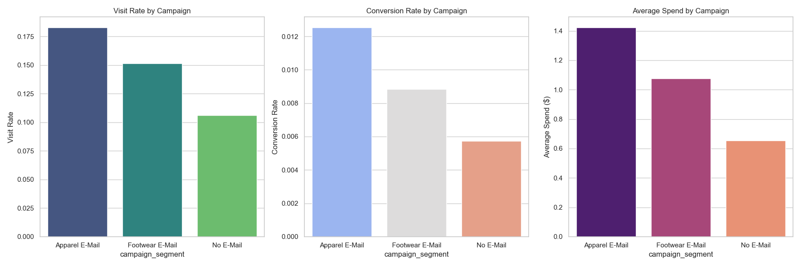
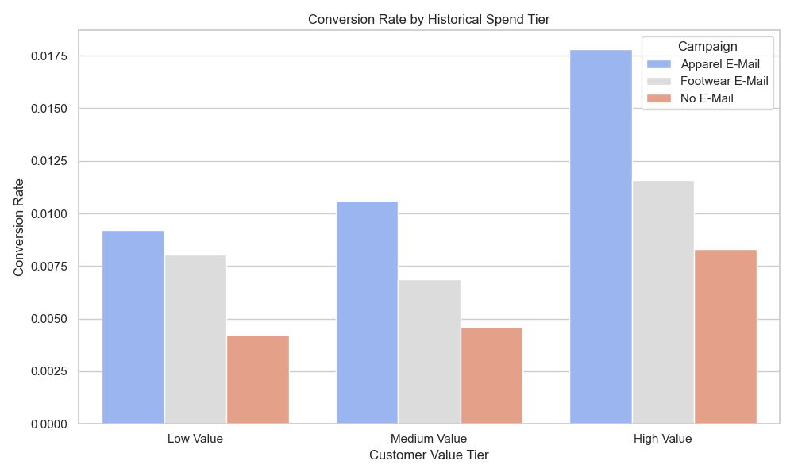
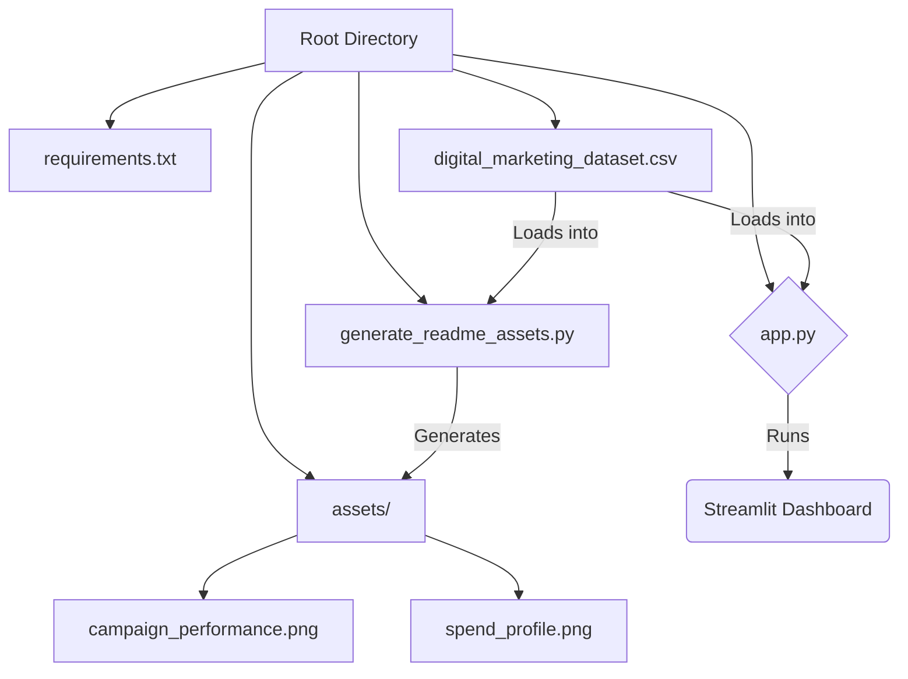

# Market Campaign Performance Analytics

## 📊 Project Overview
This project is a Streamlit-based dashboard designed to analyze the performance of marketing campaigns. It specifically focuses on evaluating the impact of different email marketing strategies (Apparel Email, Footwear Email) compared to a Control Group (No Email) on key metrics like visit rates, conversion rates, and improved spending.

The dashboard provides a narrative-driven experience, guiding users from high-level executive summaries to deep-dive segmentation and statistical validation.



## 🚀 Key Features

### 1. Executive Summary
- **High-Level Metrics**: Total users, overall conversion rate, and average spend.
- **Winning Strategy**: Automatically identifies the best-performing campaign.
- **Key Insights**: Auto-generated insights highlighting the significant drivers of performance.

### 2. Comprehensive Data Analysis
- **Data Overview**: Quick look at dataset statistics, missing values, and raw data samples.
- **Campaign Performance**: Comparative visualizations (Bar Charts) for:
    - Visit Rate
    - Conversion Rate
    - Average Spend
- **Statistical Significance**: Built-in Chi-Square and T-Tests to validate if observed differences are statistically significant (P-Value < 0.05).

### 3. Advanced Segmentation
- **Deep Dive**: Analyze how different customer segments (e.g., New vs. Existing, History of Footwear purchase) respond to campaigns.
- **Spend Profiling**: Understand conversion behavior across different customer value tiers (Low, Medium, High historical spenders).



## 🛠️ Installation

1. **Clone the repository**:
   ```bash
   git clone https://github.com/yourusername/Market-Campaign-Performance-Analytics.git
   cd Market-Campaign-Performance-Analytics
   ```

2. **Create a virtual environment** (optional but recommended):
   ```bash
   python -m venv venv
   source venv/bin/activate  # On Windows: venv\Scripts\activate
   ```

3. **Install dependencies**:
   ```bash
   pip install -r requirements.txt
   ```

## 🖥️ Usage

1. **Run the Streamlit App**:
   ```bash
   streamlit run app.py
   ```

2. **Navigate the Dashboard**:
   - Use the **Sidebar** to upload your own dataset (CSV) or use the default provided dataset.
   - Switch between **Tabs** to explore different aspects of the analysis.

## 📂 Project Structure



## 📦 Dependencies

- `streamlit`: Web application framework.
- `pandas`: Data manipulation.
- `numpy`: Numerical operations.
- `matplotlib` & `seaborn`: Data visualization.
- `scipy`: Statistical testing (Chi-square, T-test).
